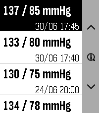
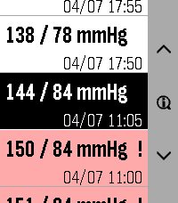
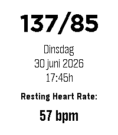
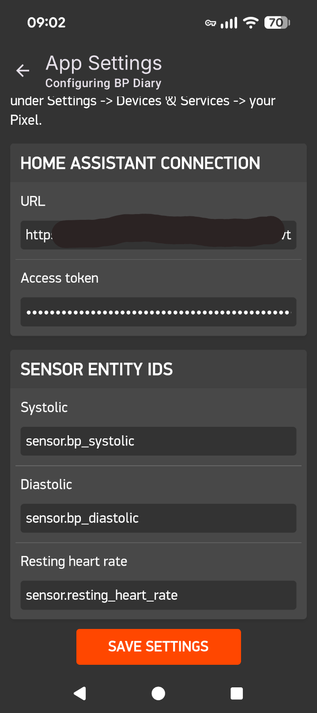

# Pebble BP Diary
Blood Pressure Diary app for Pebble Emery watch. Gets data via Health Connect on Android en Home Assistant as intermediate.
v1.3 now release-fähig with actionbar, detail page, working button navigation and RHR on detail page.

Might be way too niche to release to Pebble store ... so I'll give that another thought :-)

&nbsp; &nbsp; &nbsp;&nbsp; &nbsp; &nbsp;

Shows my Blood Pressure diary from a BT enabled Blood Pressure cuff that writes it to its Android app which syncs to Android Health Connect.

## The chain to get in onto the watch:

- Bluetooth Blood Pressure Cuff takes reading saves it to its phonre app, which syncs to Android Health Connect on the Android phone

- Home Assistant companion app on phone exposes health metrics from Android Health Connect as diagnostic sensors in HA, but you need to enable them first from the HA companion app on the phone (needs permissions). These entities are normally disabled by default...

- Setup new Template sensors in HA to actually record and store these values reliably. You'll do this easiest by adding them directly into `configuration.yaml` something like this (check naming of yours in the HA companion app after enabling them):
```yaml
template:
  - sensor:
      - name: "BP Systolic"
        unique_id: bp_systolic_recorded
        state: "{{ states('sensor.mobile_YOURDEVICE_systolic_blood_pressure') }}" # Change to your exact entity name
        unit_of_measurement: "mmHg"
        state_class: measurement
```
Don't forget to reboot HA after adding the sensors. After adding, look them up in HA and check its settings for the actual entity-ID that has been generated (you'll need it in the settings page for the Pebble app)

- Have the watch app read this sensor data through HA's REST api (needs HA instance URL, Long lived access token and correct sensor ID's of the template sensors in de setup page on the phone companion for Pebble) See screenshot below.

## Phone settings
If you want to have it work out and about, your URL needs to be the one reachable from outside (like the Nabu Casa subscription).


